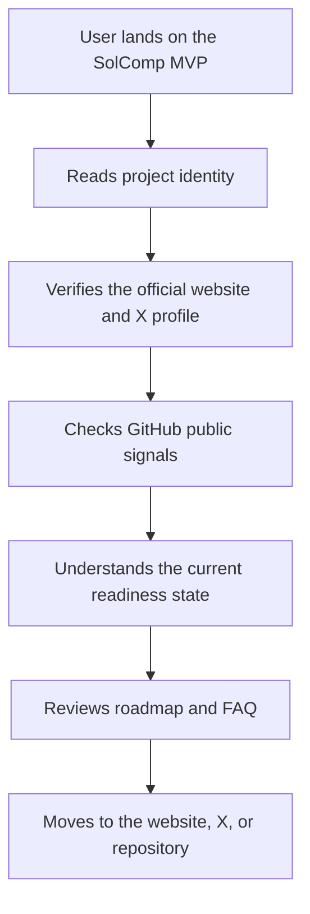
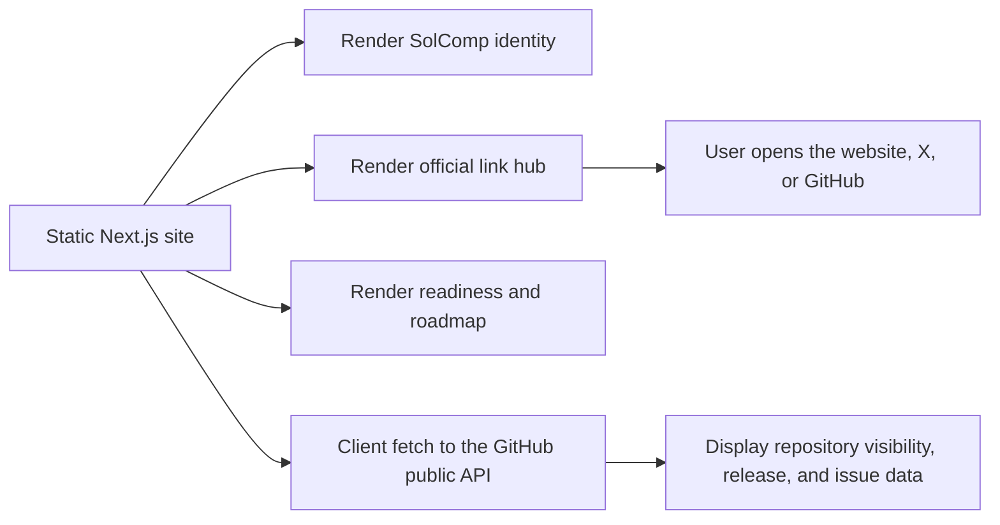

<p align="center">
  
</p>

<h1 align="center">SolComp (SOLC)</h1>

<p align="center">
  Powering the Age of Inference.
</p>

<p align="center">
  A public-facing MVP repository for the SolComp project, built to present the SOLC token narrative,
  trusted public links, launch readiness, and a GitHub-native release workflow.
</p>

## Overview

SolComp is positioned as an AI-inference-focused project surface built around one simple message:
`Powering the Age of Inference`.

This repository is the public MVP shell for that story. It combines:

- A dark, AI-native landing page
- Public project documentation
- Official link verification modules
- Readiness and roadmap visibility
- CI, release automation, and static deployment

The current MVP is designed to answer the most basic first-principles questions a user, contributor,
or community member will ask:

- What is the project?
- What is the token?
- What are the official links?
- What is already live?
- What still needs to be built?

## Official project details

- Project name: `SolComp`
- Token ticker: `SOLC`
- Narrative: `Powering the Age of Inference`
- Official website: [solcomp.xyz](https://solcomp.xyz/)
- X / Twitter: [@SolComp_SOL](https://x.com/SolComp_SOL)
- GitHub repository: [viet20016602/GitTh4Gmail](https://github.com/viet20016602/GitTh4Gmail)
- Repository Pages build: [viet20016602.github.io/GitTh4Gmail](https://viet20016602.github.io/GitTh4Gmail/)

## Official links

- Website: `https://solcomp.xyz/`
- X / Twitter: `https://x.com/SolComp_SOL`
- GitHub repository (browser): `https://github.com/viet20016602/GitTh4Gmail`
- GitHub repository (clone URL): `https://github.com/viet20016602/GitTh4Gmail.git`
- GitHub Pages build: `https://viet20016602.github.io/GitTh4Gmail/`

## Project goals

The MVP is intentionally narrow and practical. Its main goals are:

1. Establish a clean public identity for SolComp and SOLC.
2. Provide trusted navigation to the official website, social account, and source repository.
3. Expose the current readiness state of the project without over-claiming product maturity.
4. Create a polished GitHub-ready base for future product, tokenomics, or ecosystem expansion.

## Core MVP modules

The current implementation includes the following first-principles modules:

- `Identity module`
  Defines the project name, token ticker, narrative, and chain alignment.
- `Official links module`
  Gives users verified entry points to the website, social account, repository, and Pages build.
- `GitHub pulse module`
  Reads public GitHub repository state to expose real-world project signals.
- `Readiness module`
  Distinguishes what is already live from what remains pending.
- `Roadmap module`
  Converts the narrative into visible next milestones.
- `FAQ module`
  Answers the basic questions a public user will ask before deeper docs exist.

## Project features

- Dark, AI-native visual system aligned with SolComp branding
- Responsive landing page built with Next.js App Router
- PNG logo integration for stable GitHub README rendering
- Data-driven homepage modules for project identity, official links, and roadmap
- Client-side GitHub API integration for live public repository signals
- Static export support for GitHub Pages deployment
- Release workflow for version-tagged artifacts
- Contributor, security, issue, and PR governance files

## Technical architecture

### Frontend stack

- Next.js 16
- React 19
- TypeScript 5
- Tailwind CSS 4
- Lucide React icons

### Delivery stack

- GitHub Actions for CI
- GitHub Pages for static deployment
- GitHub Releases for versioned artifacts

### Architectural principles

- `Static-first`
  The project is exportable as a static site for low-friction deployment.
- `Content-driven`
  Homepage and docs content are driven from centralized data structures where possible.
- `Trust-first`
  Official links and repository state are treated as core product surface, not footnotes.
- `MVP honesty`
  The site explicitly separates shipped elements from pending ones.

## Repository architecture

```text
src/
  app/
    docs/                 Docs route
    privacy/              Privacy page
    terms/                Terms page
    globals.css           Global design system and theme
    layout.tsx            Metadata and app shell
    page.tsx              Main landing page
    robots.ts             Robots metadata route
    sitemap.ts            Sitemap metadata route
  components/
    brand-mark.tsx        Shared SolComp mark
    faq-accordion.tsx     FAQ interaction module
    link-hub.tsx          Official links module
    neural-field.tsx      Hero visualization
    readiness-board.tsx   Readiness progress module
    repo-pulse.tsx        GitHub public status module
    section-heading.tsx   Shared section heading component
  lib/
    content.ts            Project copy, module data, roadmap, FAQ
public/
  brand/
    logo.png              README and frontend logo asset
  og-cover.svg            Social preview image
docs/
  PROTOCOL.md             Repository-side project overview
.github/
  ISSUE_TEMPLATE/         Public issue forms
  workflows/              CI, Pages, and release workflows
```

## Process Flow

The MVP follows a simple public process flow:



## Application flow

At a functional level, the current MVP behaves like this:



## Project progress

### Current status

- [x] SolComp branding integrated
- [x] SOLC identity added to the public project surface
- [x] README logo integrated for GitHub rendering
- [x] Identity, links, GitHub pulse, readiness, roadmap, and FAQ modules implemented
- [x] Docs route available
- [x] CI, Pages deployment, and release workflow configured
- [ ] Token contract details published
- [ ] Tokenomics and allocation model documented
- [ ] Launch or ecosystem dashboard connected
- [ ] Announcement or updates feed added

### Progress summary

The project has already completed the public-facing MVP shell.
The next phase is to attach stronger product and token utility detail to the existing structure.

## Project roadmap

### April 2026 - Phase 01: Public foundation

- Brand identity
- Token ticker alignment
- Official links
- Public repository shell

### May 2026 - Phase 02: Utility definition

- Tokenomics
- Contract address publication
- SOLC utility model
- Ecosystem role descriptions

### June 2026 - Phase 03: Product visibility

- Interactive dashboards
- Launch metrics
- Announcements module
- Partner or ecosystem pages

### July 2026 and beyond - Phase 04: Public growth loop

- Stronger docs
- Community updates
- More frequent releases
- Expanded contributor workflows

## Local development

### Prerequisites

- Node.js 24 or newer recommended
- npm 11 or newer recommended

### Installation

```bash
npm install
```

### Start the development server

```bash
npm run dev
```

Open:

```text
http://localhost:3000
```

### Production build

```bash
npm run build
```

### Validation

```bash
npm run lint
npm run typecheck
npm run build
```

## Available scripts

- `npm run dev`
  Start the local development server.
- `npm run build`
  Create the production static export build.
- `npm run lint`
  Run ESLint across the codebase.
- `npm run typecheck`
  Generate Next route types and run TypeScript checks.
- `npm run preview`
  Serve the built `out/` directory locally.

## Configuration

The project currently works without a custom `.env` file, but supports these runtime values:

- `NEXT_PUBLIC_SITE_URL`
  Controls the metadata base URL and social preview URL generation.
- `GITHUB_PAGES`
  Used by the build configuration to enable the GitHub Pages base path behavior.

### Example

```bash
NEXT_PUBLIC_SITE_URL=https://solcomp.xyz/
GITHUB_PAGES=false
```

## Deployment

This repository is configured for static export and GitHub Pages deployment.

### GitHub Pages

- Push to `main` to trigger the Pages workflow
- Repository-hosted build URL:
`https://viet20016602.github.io/GitTh4Gmail/`

### Official website

- Primary public website:
  `https://solcomp.xyz/`

### Releases

- Push a semantic version tag such as `v0.1.0`
- GitHub Actions builds the static export
- A release artifact is attached automatically

## Why this MVP is useful

This repository does not pretend to be a full production protocol or full token launch stack.
Its value is that it creates a clean and credible public base:

- The project identity is explicit
- The official links are verifiable
- The repository has visible release discipline
- The launch state is honest
- The design is strong enough to be shared publicly now

## FAQ

### What is SolComp?

SolComp is the project identity presented in this repository and linked to the official site `solcomp.xyz`.

### What is SOLC?

SOLC is the token ticker associated with the SolComp project narrative.

### What does "Powering the Age of Inference" mean?

It is the core project message. It positions SolComp around the rise of AI inference and infrastructure-oriented compute demand.

### Is this a full production application?

No. This is a public MVP surface focused on identity, trusted links, readiness, and repository operations.

### What is still missing?

The biggest missing pieces are tokenomics, contract details, utility definitions, and stronger live product signals.

### Why does the README use PNG for the logo?

PNG is more reliable than SVG for GitHub README rendering, so it is used intentionally for stable display.

## Governance

- [CONTRIBUTING.md](./CONTRIBUTING.md)
- [SECURITY.md](./SECURITY.md)
- [CHANGELOG.md](./CHANGELOG.md)
- [docs/PROTOCOL.md](./docs/PROTOCOL.md)

## License

This project is released under the [MIT License](./LICENSE).
